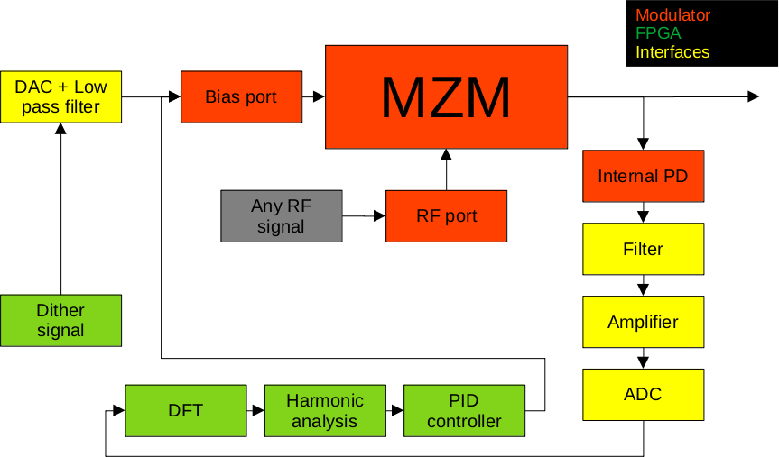

# MZM Model and bias drift algorithm

## Intro
This is a demostrative script that I used for a feasibility study of a bias controller for a Mach-Zehnder modulator (MZM), commonly used in fibre optic applications. Unfortunately the project did not take off, hence I am leaving this here for future memory.

MZMs suffer of bias drift, i.e. the operative point moves due to vibrations, temperature and other effects. In high speed applications, it is desirable to keep this in place by using some sort of feedback control. I assume you have an idea of the literature to date. Here is the ideal high-level arrangement that I had in mind for the controller.



The script shows two things at the same time:
1. An ideal transfer function with an ideal pilot signal as input.
2. The estimation of the bias drift, its magnitude and its sign, if we consider the input signal as pilot tone (dither). Note that normally the characteristics of the input signal used as pilot tone are fully controlled and chosen accordingly.

## Prepare the environment and execute the script
```
python3 -m venv venv
source ./venv/bin/activate
pip install -r requirements.txt
python mzm.py
```